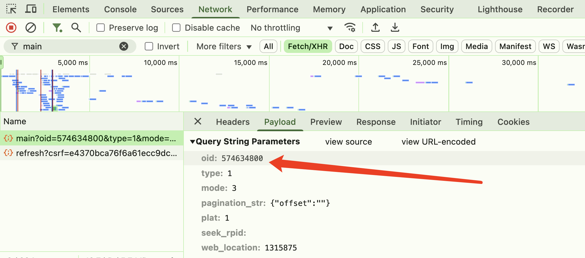

# &#x1F308;&#x1F308;&#x1F308;bilibili 评论爬取&#x1F308;&#x1F308;&#x1F308;

⭐**重点**：但是本项目只是学习使用，如果用作任何其他用途，本人概不负责！！！⚠⚠⚠

### 该项目只适用学习其他任何用途均不可使用！！！

### 该项目只适用学习其他任何用途均不可使用！！！

### 该项目只适用学习其他任何用途均不可使用！！！

## 步骤：

- 1、找到自己想要爬取视频的 oid

- 2、设置 cookies

## 找到视频的 oid

有些视频的 oid 会在视频的 url 那里显示，比如下面的视频 oid 就是 114104178251292

```
https://www.bilibili.com/list/watchlater?oid=114104178251292&bvid=BV13g9JY7ErA&spm_id_from=333.1007.top_right_bar_window_view_later.content.click
```

有些视频则没有（可能是没放到稍后观看的问题），需要打开 f12 自行获取

## 如何在开发者工具中找到 oid



1. 打开视频页面，按 F12 打开开发者工具
2. 切换到 Network 标签
3. 刷新页面，在筛选框中输入 "main"
4. 找到类似 "main?oid=xxx" 的请求
5. 在请求 URL 中即可找到 oid 参数

## 设置 cookies

命令行跑一下

```
cp .env.example .env
```

调一下参数

```javascript
COOKIES = your_cookies_here;
OID = 视频的oid;
```

然后 yarn dev 跑就完事了
